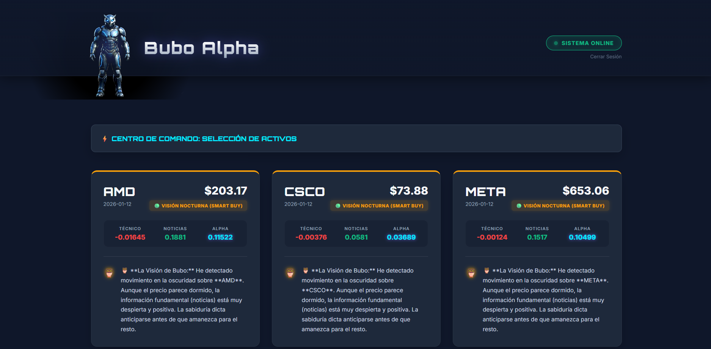

# 🦉 Bubo Alpha: Algorithmic Trading Dashboard

Plataforma de inteligencia financiera impulsada por Python. Bubo Alpha procesa datos de mercado en tiempo real, analiza el sentimiento de noticias y genera señales de trading (Compra/Venta) visualizadas en un dashboard interactivo.




## Características Principales

* **Sistema de Autenticación:** Login y Registro seguro con encriptación (Bcrypt).
* **Pipeline de Datos:** ETL automatizado que extrae datos de Yahoo Finance.
* **Análisis Técnico:** Cálculo automático de RSI y Medias Móviles.
* **Watchlist Personalizada:** Los usuarios pueden configurar sus propios activos por sectores (Crypto, Tech, Forex).
* **UI Futurista:** Interfaz "Dark Mode" diseñada con CSS puro y Jinja2.


## El Cerebro: Algoritmo "Alpha Score"

El corazón de la plataforma es el **Alpha Score**, una métrica compuesta diseñada para filtrar el ruido del mercado y detectar oportunidades de alta probabilidad. A diferencia de los indicadores tradicionales, Bubo Alpha utiliza un enfoque híbrido:

### 1. Factor Técnico (Momentum & Tendencia)
El sistema analiza la estructura de precios histórica utilizando `pandas` para calcular:
* **SMA (50-day Simple Moving Average):** Determina la tendencia macro (Alcista/Bajista).
* **RSI (Relative Strength Index):** Detecta condiciones extremas de sobrecompra (>70) o sobreventa (<30).

### 2. Factor de Sentimiento (News Sentiment)
Bubo Alpha monitorea el "humor" del mercado. El pipeline ingesta titulares financieros recientes y evalúa el tono emocional (Positivo/Negativo/Neutral) asociado a cada activo.

### 📉 La Fórmula de Decisión
El sistema fusiona ambos factores para generar una señal final:

| Alpha Score | Señal | Interpretación |
| :--- | :--- | :--- |
| **Alto (+)** | 🟢 `VUELO (COMPRA)` | Tendencia alcista + Sentimiento positivo + RSI favorable. |
| **Bajo (-)** | 🔴 `CAÍDA (VENTA)` | Debilidad técnica + Noticias negativas o RSI en sobrecompra. |
| **Neutro** | 🟡 `PRUDENCIA` | Señales mixtas o mercado lateral. Mejor esperar. |
## Tecnologías Usadas

* **Backend:** Python 3.12, Flask, SQLAlchemy.
* **Data Science:** Pandas, Yahoo Finance API (yfinance).
* **Frontend:** HTML5, CSS3, Jinja2.
* **Base de Datos:** SQLite.

## Instalación y Uso (Local)

1.  Clonar el repositorio:
    ```bash
    git clone [https://github.com/TU_USUARIO/bubo-alpha.git](https://github.com/TU_USUARIO/bubo-alpha.git)
    ```
2.  Crear entorno virtual e instalar dependencias:
    ```bash
    python -m venv venv
    source venv/Scripts/activate  # En Windows
    pip install -r requirements.txt
    ```
3.  Ejecutar el Pipeline de Datos:
    ```bash
    python -m src.pipeline.run_pipeline
    ```
4.  Iniciar el Servidor:
    ```bash
    python -m src.app
    ```

---
Desarrollado por [Tu Nombre] - Estudiante de Economía & Data Science.